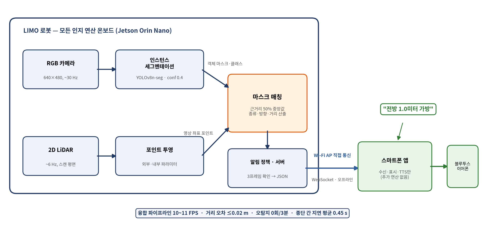
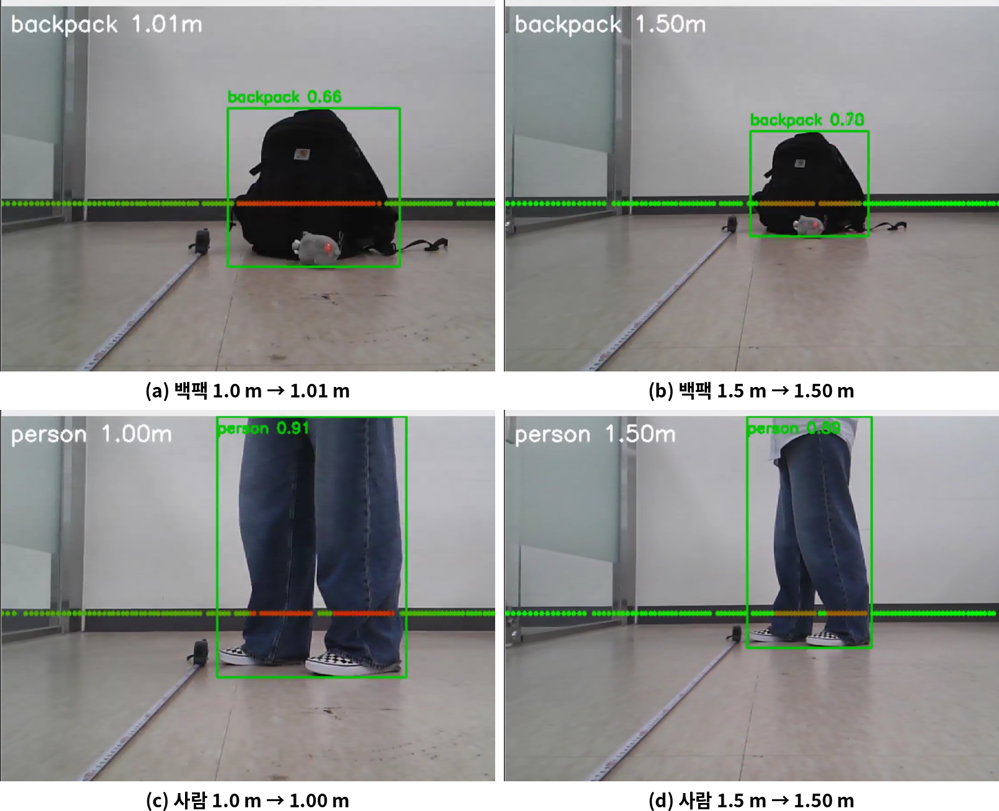

# limo-fusion-guide

2D LiDAR + 단안 카메라 융합으로 장애물의 종류·방향·거리를 실시간 산출하는
시각장애인 안내 로봇 서버. 모든 연산은 Jetson Orin Nano 온보드에서 실행.

📱 App: [limo-guide-app](https://github.com/byulla/limo-guide-app)



## Results
- 거리 오차 ≤ 0.02 m (1.0/1.5 m 실측)
- 빈 환경 3분 오탐지 0회
- 융합 파이프라인 10–11 FPS, 종단 간 지연 ~0.45 s



## Run
```bash
roslaunch limo_bringup limo_start.launch      # T1: LiDAR
roslaunch astra_camera dabai_u3.launch        # T2: camera
/usr/bin/python3 fusion_server.py             # T3: server → ws://0.0.0.0:8765
```

시각화: `rqt_image_view` → `/fusion/annotated`

## Message
```json
{"type":"obstacle","direction":"front","distance":1.01,"urgency":"warn","label":"backpack"}
```

로컬 네트워크 전용 설계 (인증 없음).
